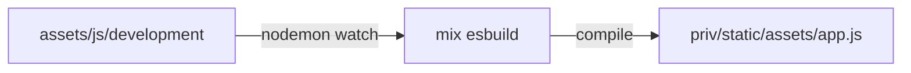
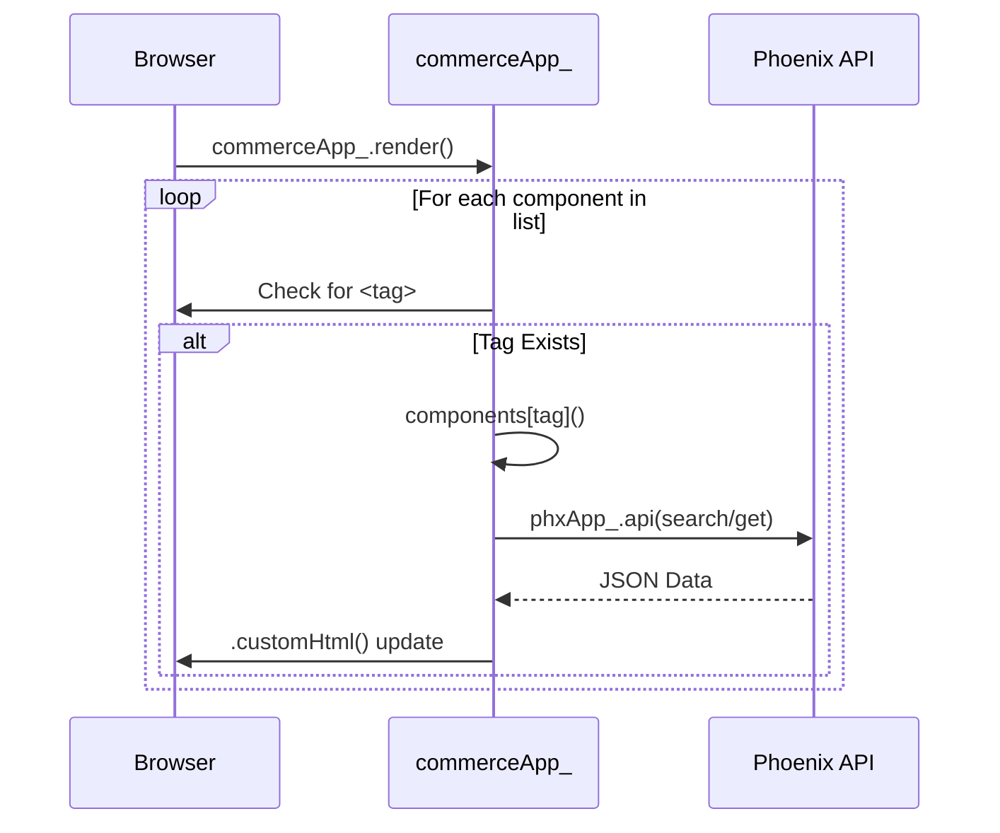

# Commerce Front Rendering & Build Flow

This document describes how JavaScript is compiled and how components are rendered in the browser.

## Build Process

The project uses `nodemon` to monitor changes in the `assets/js` directory and `esbuild` to bundle the code.

## Frontend Rendering Flow

The application uses a custom rendering engine defined in `commerce_app.js`.

## Component List
The following components are automatically rendered by the `render()` function if their tags are present:
- `merchantProducts`
- `cartItems`
- `merchantProfile`
- `topup`
- `products`
- `rewardList`
- And others...
