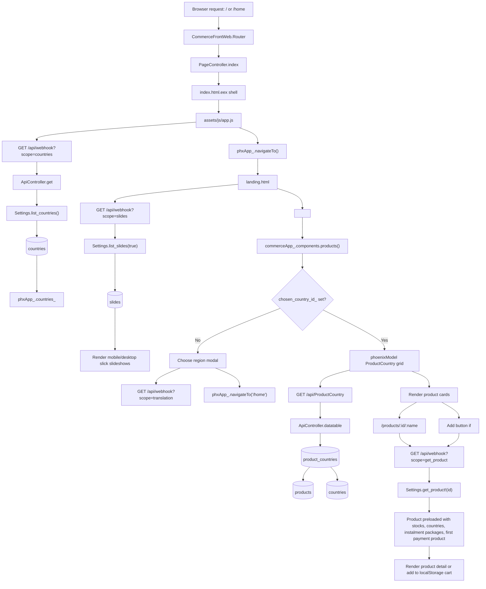
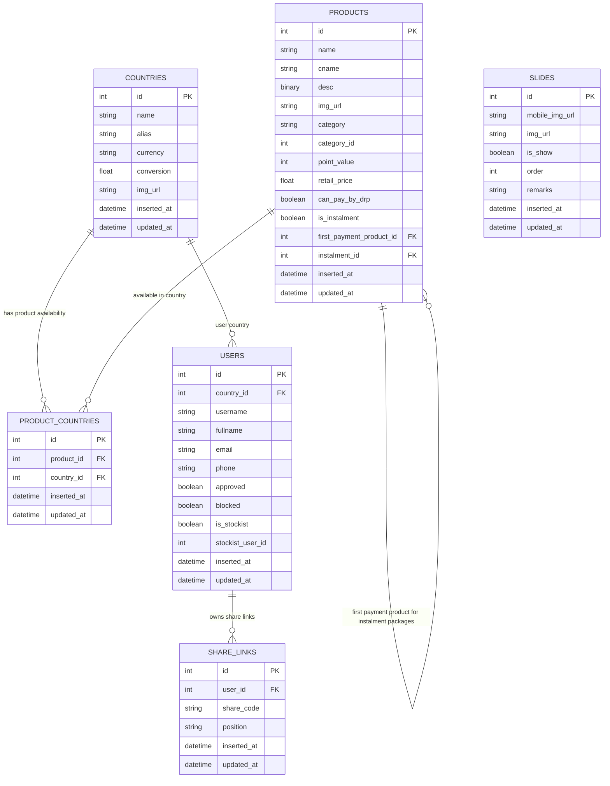

# Landing And Product Flow

This document traces the storefront entry points from the Phoenix shell through the landing page, product grid, product detail page, and the backend functions/data models those pages use.

## Entry Points

| File | Role |
| --- | --- |
| `lib/commerce_front_web/templates/page/index.html.eex` | Phoenix shell rendered by `PageController.index`; provides `#content`, footer links, install prompt UI, modals, toast host, and loading overlay. |
| `priv/static/html/v2/landing.html` | Home page fragment loaded into `#content`; renders slideshow containers and the `<products>` component. |
| `assets/js/commerce_app.js` | Storefront component library; renders `<products>`, `<product>`, cart behavior, region selection, product pricing, and API calls. |

## Data Flow

## Backend Trace

| Frontend action | API endpoint | Backend function | Data accessed | Result |
| --- | --- | --- | --- | --- |
| App boot loads countries | `GET /api/webhook?scope=countries` | `ApiController.get` -> `Settings.list_countries()` | `countries` | Populates `phxApp_.countries_` for region selection and pricing conversion. |
| Landing page loads slides | `GET /api/webhook?scope=slides` | `ApiController.get` -> `Settings.list_slides(true)` | `slides` where `is_show == true` | Builds mobile and desktop slideshow markup in `landing.html`. |
| Landing page renders products | `GET /api/ProductCountry` | `ApiController.datatable` via `phoenixModel` | `product_countries` joined to `products`; filtered by `country_id` and `b.is_instalment=false` | Returns grid rows used to render product cards. |
| Product card opens detail page | Client route `/products/:id/:name` | `phxApp_.navigateTo` loads `product.html`; `commerceApp_.components.product()` runs | No server-side route change beyond shell fallback | Product detail component reads `pageParams.id`. |
| Product detail fetches product | `GET /api/webhook?scope=get_product&id=:id` | `ApiController.get` -> `Settings.get_product!(id)` | `products`, with `stocks`, `countries`, `instalment_packages`, `first_payment_product` preloaded | Renders product detail, price, PV, instalment choices, and Add button. |
| Add product to cart | Usually reuses `get_product`; then client-side cart methods | `commerceApp_.addItem_`, `updateCart`, `cartItems` | Browser `localStorage` keys `cart`, `first_cart_country_id` | Adds item locally and validates it belongs to selected/first cart country. |
| Shared-code region path, if present | `GET /api/webhook?scope=get_share_link_by_code&code=:share_code` | `ApiController.get` -> `Settings.get_share_link_by_code(code)` -> preload `:user` | `share_links`, `users` | Selects sponsor/user country and displays sponsor/bank metadata in pages that use `pageParams.share_code`. |

## Entity Relationship Diagram

## Frontend Page Table

| Route or page | Template/fragment | Component or script | What it does |
| --- | --- | --- | --- |
| `/` and fallback routes | `index.html.eex` | `phxApp_.navigateTo()` | Serves the SPA shell, then client-side navigation decides which static HTML fragment to load. |
| `/home` | `landing.html` | Inline slide script, `<products>` | Shows homepage slideshow and the new-arrivals product grid. |
| `/products/:id/:name` | `product.html` | `commerceApp_.components.product()` | Shows one product, pricing, description, instalment choices, and Add-to-cart action. |
| Footer link `/refund_policy` | `refund_policy.html` | Route metadata in `app.js` | Public policy page loaded without the normal nav. |
| Footer link `/terms_condition` | `terms_condition.html` | Route metadata in `app.js` | Public terms page loaded without the normal nav. |
| Floating menu `/sales` | `sales.html` | `commerceApp_` sales-related components | Authenticated sales history page; not deeply traced in this pass. |
| Floating menu `/group_sales` | `gs_summary.html` | group sales components | Authenticated group sales summary; not deeply traced in this pass. |
| Floating menu `/placement` | `placement.html` | placement component | Authenticated placement view; not deeply traced in this pass. |
| Floating menu `/placement_full` | `placement_full.html` | placement component | Authenticated full placement view; not deeply traced in this pass. |
| Floating menu `/referal` | `referal.html` | referral component | Authenticated referral/downline view; not deeply traced in this pass. |

## Notes And Questions

- `commerceApp_.components.products()` sometimes assigns `phxApp_.chosen_country_id_` to a country id string and elsewhere code reads it like a country object with `.id`, `.name`, and `.conversion`. I documented the intended country object flow, but this inconsistency should be verified.
- `showRP`, `includeShippingTax`, and `translationRes` are used as globals in this flow. Their initial values affect pricing display and language replacement, but they are not owned by the three starting files.
- The product grid uses the generic datatable builder and sends dynamic join/search parameters. The ER diagram shows the schema relationships, not every dynamic query branch in `ApiController.datatable`.
